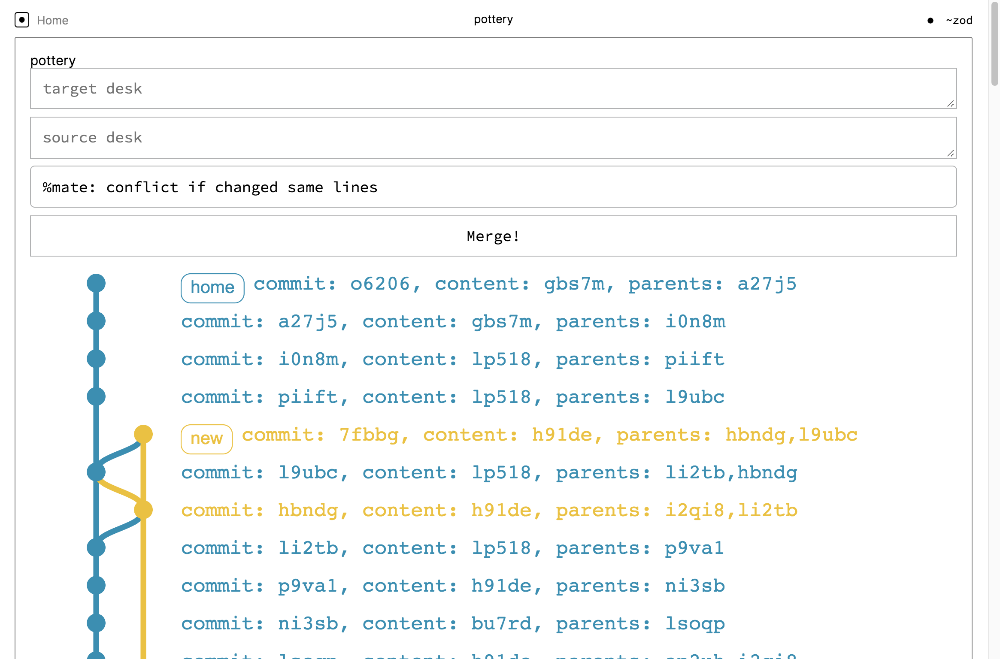

## Installation

Clone this repository, `npm install`, fill in your .urbitrc, and then run `npm run serve` to get started.  Example .urbitrc:

```
module.exports = {
  URBIT_PIERS: [
    "/Users/dev/zod/home",
  ]
};
```

In order to run your application on your ship, you will need Urbit v.0.10.0 or higher. On your Urbit ship, if you haven't already, mount your pier to Unix with `|mount %`.

## Using

Once you're up and running, your tile lives in `tile/tile.js`, which uses [React](https://reactjs.org) to render itself -- you'll want a basic foothold with it first. When you make changes, the `urbit` directory will update with the compiled application and, if you're running `npm run serve`, it will automatically copy itself to your Urbit ship when you save your changes (more information on that below).

### `npm run build`

This builds your application and copies it into your Urbit ship's desk. In your Urbit `|commit %home` (or `%your-desk-name`) to synchronise your changes.

If this is the first time you're running your application on your Urbit ship, don't forget to `|start %pottery`.

### `npm run serve`

Builds the application and copies it into your Urbit ship's desk, watching for changes. In your Urbit `|commit %home` (or `%your-desk-name`) to synchronise your changes.
